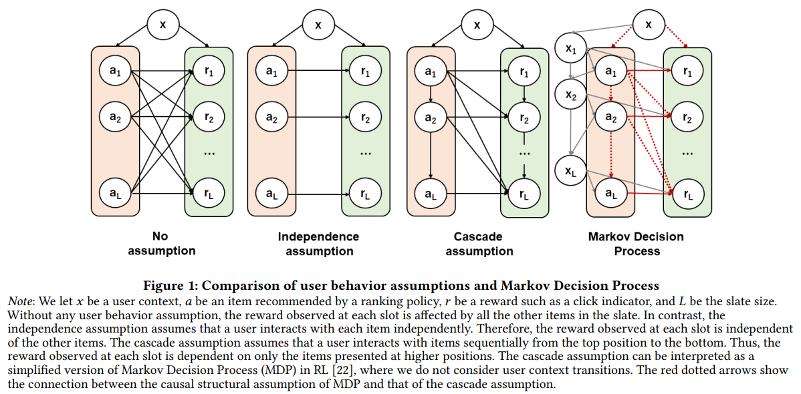

## Doubly Robust Off-Policy Evaluation for Ranking Policies under the Cascade Behavior Model

---

### About
This repository contains the code to replicate the synthetic experiment conducted in the paper "[Doubly Robust Off-Policy Evaluation for Ranking Policies under the Cascade Behavior Model](https://dl.acm.org/doi/10.1145/3488560.3498380)" by [Haruka Kiyohara](https://sites.google.com/view/harukakiyohara), [Yuta Saito](https://usait0.com/en/), Tatsuya Matsuhiro, Yusuke Narita, Nobuyuki Shimizu, and Yasuo Yamamoto, which has been honored as **Best Paper Award Runner-Up** at [WSDM2022](https://www.wsdm-conference.org/2022/). [[paper](https://dl.acm.org/doi/10.1145/3488560.3498380)] [[arXiv](https://arxiv.org/abs/2202.01562)] [[slide](https://speakerdeck.com/harukakiyohara_/cascade-doubly-robust-ope-for-ranking)]

<details>
<summary><strong>Click here to show the abstract </strong></summary>

 

In real-world recommender systems and search engines, optimizing ranking decisions to present a ranked list of relevant items is critical. Off-policy evaluation (OPE) for ranking policies is thus gaining a growing interest because it enables performance estimation of new ranking policies using only logged data. Although OPE in contextual bandits has been studied extensively, its naive application to the ranking setting faces a critical variance issue due to the huge item space. To tackle this problem, previous studies introduce some assumptions on user behavior to make the combinatorial item space tractable. However, an unrealistic assumption may, in turn, cause serious bias. Therefore, appropriately controlling the bias-variance tradeoff by imposing a reasonable assumption is the key for success in OPE of ranking policies. To achieve a well-balanced bias-variance tradeoff, we propose the Cascade Doubly Robust estimator building on the cascade assumption, which assumes that a user interacts with items sequentially from the top position in a ranking. We show that the proposed estimator is unbiased in more cases compared to existing estimators that make stronger assumptions. Furthermore, compared to a previous estimator based on the same cascade assumption, the proposed estimator reduces the variance by leveraging a control variate. Comprehensive experiments on both synthetic and real-world data demonstrate that our estimator leads to more accurate OPE than existing estimators in a variety of settings.

</details>

If you find this code useful in your research then please site:
```
@inproceedings{kiyohara2022doubly,
  author = {Kiyohara, Haruka and Saito, Yuta and Matsuhiro, Tatsuya and Narita, Yusuke and Shimizu, Nobuyuki and Yamamoto, Yasuo},
  title = {Doubly Robust Off-Policy Evaluation for Ranking Policies under the Cascade Behavior Model},
  booktitle = {Proceedings of the 15th International Conference on Web Search and Data Mining},
  pages = {487--497},
  year = {2022},
}
```

### Dependencies
This repository supports Python 3.7 or newer.

- numpy==1.20.0
- pandas==1.2.1
- scikit-learn==0.24.1
- matplotlib==3.4.3
- obp==0.5.2
- hydra-core==1.0.6

Note that the proposed Cascade-DR estimator is implemented in [Open Bandit Pipeline](https://github.com/st-tech/zr-obp) (`obp.ope.SlateCascadeDoublyRobust`).

### Running the code
To conduct the synthetic experiment, run the following commands.

(i) run OPE simulations with varying data size, with the fixed slate size.
```bash
python src/main.py setting=n_rounds
```

(ii), (iii) run OPE simulations with varying slate size and policy similarities, with the fixed data size.
```bash
python src/main.py
```
Once the code is finished executing, you can find the results (`squared_error.csv`, `relative_ee.csv`, `configuration.csv`) in the `./logs/` directory. Lower value is better for squared error and relative estimation error (relative-ee).

### Visualize the results
To visualize the results, run the following commands.
Make sure that you have executed the above two experiments (by running `python src/main.py` and `python src/main.py setting=default`) before visualizing the results.
```bash
python src/visualize.py
```

Then, you will find the following figures (`slate size (standard/cascade/independent).png`, `evaluation policy similarity (standard/cascade/independent).png`, `data size (standard/cascade/independent).png`) in the `./logs/` directory. Lower value is better for the relative-MSE (y-axis).

| reward structure                        |  Standard                                                      |  Cascade                                                        |      Independent               |
| :-------------------------------------: | :------------------------------------------------------------: | :-----------------------------------------:                   | :------------------------------------------------------------: |
| varying data size (n)                    |                     |                     |                     |
| varying slate size (L)                   |                    |                    |                    |
| varying evaluation policy similarity (λ) |  |  |  |
